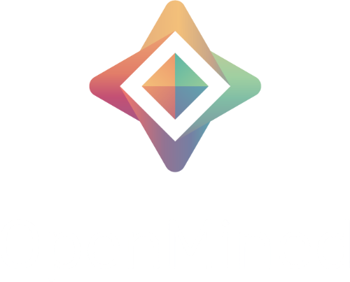

<h1 align="center">

  <br>
  <a href="http://duet.openmined.org/"></a>
  <br>
  <br>
<!--   The syft network -->
  <br>

</h1>

# The Syft Registry

Welcome. When you run the following code:

```
import syft as sy
sy.datasites
```
You'll see a list of public datasites you can use to study private data. If you'd like to add your datasite to this list, please submit a pull request editing the "datasites.json" file. Make sure to add all the fields and use the same conventions you see from other datasites. If you have questions, message #support in slack.openmined.org.
